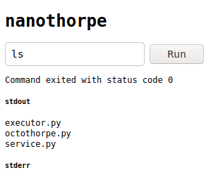

# nanothorpe writeup

This is the writeup for the DefCon 2020 Nanothorpe CTF challange, I learned a lot working on it so I will share my notes.

## Challange description

You can find the challenge [here](https://2020.ctf.link/internal/challenge/5cbca392-d235-4652-a865-8bd2eaba8039). Mirror is down by now, but the full thing is available for local environment as Docker container, all the file are [here](https://2020.ctf.link/assets/files/nanothorpe-d2095dcfeda4b08d.tar.xz).

This challange has the following components:

- a simple web frontend (index.html)
- a service backend (service.py)
- an hashing functions (octothorpe.py)
- a command execution engine (executor.py)

Docker file and a custom `ynetd` binary are also included. `ynetd` is used to lazily load the executor when a request from `service.py` is forwarded to the `executor.py`. If you are interest, more details [here](https://github.com/rwstauner/ynetd).

By building the docker image, the entire system can run locally.

This is how the frontend presents itself 



Simply put it:

- user send a command from the web frontend
- `service.py/api/authorize` validate the command, only `ls` is accepted
- `service.py/api/authorize` set an `expiry` timestamp 15 seconds in the future and embed it, together with the command, as URL parameter
- the API request parameters are signed using the custom hash function in `octothorpe.py`
- signature is set as Cookie 
- `service.py` proceed now redirecting the frontend to the `/api/run` route
- the `request.query_string` signature is verified, if ok, the command is forwarded to `executor.py`
- the stdout and stderr of command execution are returned back and displayed on the frontend

## Initial exploration

Looking at the Dockerfile, we can see a hint of the flag being generated at the moment of building the Docker image on the official mirror, as well as the `server-secret` file, which we will get to soon.

Here the snippet from the local Dockerfile, where the flag is simply `FLAG`

```
# echo 'hxp{FLAG}' > flag.txt && head -c 32 /dev/urandom > server-secret && docker build -t nanothorpe . && docker run --cap-add=SYS_ADMIN --security-opt apparmor=unconfined -ti -p 8832:80 nanothorpe

...

COPY flag.txt /flag.txt
RUN chown root:root /flag.txt && \
    mv flag.txt flag_$(< /dev/urandom tr -dc a-zA-Z0-9 | head -c 24).txt && \
    chmod 444 /flag_*.txt

```

Also important to note that the `server-secret` file contains 32 bytes, as we can see from the `head -c 32 /dev/urandom > server-secret` suggestion in comment.

The first strategy that comes to mind is straightforward:

- bypass `/api/authorize`
- directly call `/api/run` to execute arbitrary command 
- read the content of the `/flag_xyz.txt` file
- profit.

## API Authorization

The `service.py` file is the only component reading the `server-secret`, pre-pending it to the list of HTTP GET query parameters to calculate the signature.

We clearly need a way to calculate this signature by ourselves, without relying on the `/api/authorize`.

## Hashing algorithm

Let's have a look at the hashing function implemented in `octothorpe.py`.

We have a constructor that initialize some internal state variables

```
def __init__(self, data: bytes = None, *, _cache: bytes = None, _length: int = None, _state: bytearray = None) -> None:
        self._cache = _cache or b''
        self._length = _length or 0
        self._state = _state or self.initial_state[:]
        assert len(self._state) == self.state_size, 'Invalid state size'
        if data:
            self.update(data)
```
An `update` function, that in case of data being passed, store it in the internal `_cache` variable

```
def update(self, data: bytes) -> None:
        self._cache += data
        while len(self._cache) >= self.block_size:
            block, self._cache = self._cache[:self.block_size], self._cache[self.block_size:]
            self._compress(block)
            self._length += self.block_size
```

A `_compress` function that operate the transformation on the internal `_state` (the `print` statement are mine)

```
def _compress(self, block: bytes) -> None:
        prev_state = lambda index: (index - 1) % self.state_size
        next_state = lambda index: (index + 1) % self.state_size
        rol = lambda value, shift, size: ((value << (shift % size)) | (value >> (size - (shift % size)))) & ((1 << size) - 1)
        ror = lambda value, shift, size: ((value >> (shift % size)) | (value << (size - (shift % size)))) & ((1 << size) - 1)
        for r in range(self.round_count):
            state = self._state[:]
            for i in range(self.block_size):
                j, jj = (i * r) % self.state_size, (i * r) % self.shift_count

                # print(state.hex(), self._state.hex(), "- r:", r, "i:", i, " - ", j, jj, " -- state[j]:", format(state[j], '02x'), format(self._state[prev_state(j)], '02x'), format(self._state[next_state(j)], '02x'), rol(state[j], self.shift[jj], 8), ror(state[j], self.shift[jj], 8) )

                self._state[prev_state(j)] ^= self.sbox[block[i] ^ rol(state[j], self.shift[jj], 8)]
                self._state[next_state(j)] ^= self.sbox[block[i] ^ ror(state[j], self.shift[jj], 8)]
```

and finally a `_finalize` function that return the calculate internal state, or `signature` in our case, when all the data has been processed

```
    def _finalize(self) -> bytearray:
        clone = self.copy()
        clone._length += len(clone._cache)
        clone.update(b'\x80' + b'\x00' * ((self.block_size - 9 - clone._length) % self.block_size) + (8 * clone._length).to_bytes(8, 'little'))
        return clone._state
```

At this point, I wasted a lot of time trying to run this functions in reverse, moved by the intuition that the value of the `server-secret` was actually being passed as block during the iteration. 

The intention was to somehow algebrically derive `block[i]` given that the initial and final `_state` were known

```
self._state[prev_state(j)] ^= self.sbox[block[i] ^ rol(state[j], self.shift[jj], 8)]
```

As it turned out, this was the wrong direction, but in order to avoid wasting all that time, I will at least post the handwritten attempt to color the page a little

!(Wrong direction)[images/wrong-strategy-1.jpg]
!(More wrong direction)[images/wrong-strategy-2.jpg]

So, the attempt to resolve the challenge with math did not result in anything good.

The general approach of manually signing a request to `/api/run` still feel right, but there is no obvious way to read the remote server secret.

At this point, the right hint was provided by (TalaatHarb)[https://github.com/TalaatHarb], which point out to the concept of Length Extension Attack.

## Length Extension Attack

As it turn out, it is quite common knowledge in the cryptography space that several hashing algorithm are vulnerable to the so called Length Extension Attack. Actually, this is not really a vulnerability of the hashing algorithm, but rather a weak spot of the way hashing function are used. 

There is a good explanation (here)[https://soatok.blog/2020/10/06/dead-ends-in-cryptanalysis-1-length-extension-attacks/], but the main points are the following:

Several hashing algorithm are designed to work with data stream, operating on fixed-size blocks of data which get updated (see the `_update()` in `octothorpe.py`) rather than loading the entire data all at once

This makes sense, think about the use case of verifying the signature of a huge file.

This approach, if not correctly handled, opens up the door for a Length Extension Attack, which allows to calculate the hash of a piece of data even without knowing the prepended secret.

Let's look at how the signature is calculated in our case:

```
def sign(data):
    return octothorpe(secret + data).hexdigest()
```

So the data (the query parameters) are appended to the secret and the hash is calculated. 
The hashing function works on blocks of 64 bytes per time, and if the total data length is not a multiple of the block_size, a padding is added at the end

```
clone.update(b'\x80' + b'\x00' * ((self.block_size - 9 - clone._length) % self.block_size) + (8 * clone._length).to_bytes(8, 'little'))
```

Because this hashing algorithm is vulnerable to LEA, we can consider to add additioanl data at the end and calculate a valid hash, simply by instructing the hashing algorithm to start from the given signature as initial state. In pseudo-code

```
length = len(secret + data + padding)
signature = hash(secret + data + padding + new_data) == hash(new_data, _length=length, _state=signature )
```

Basically, instead of calculating the hash starting from the concatenation of `secret` and data, we calculate the hash only of the new data we want to append at the end, given as initial condition the signature calculated for the first part of the data.

This tecnique allow us to calculate a valid hash of the `secret + data + padding + new_data` without knowing the `secret`, but simply keep iterating as if new pieces of data are being feeded to the hash function.

## Bring it all together

To make a step back, here what we know we can do now:

- send a regular request for `ls` command through the frontend
- read the calculated `signature` of the `expiry` and `cmd` query parameter (`decode`)
- using `signature` and the known length of the secret (from comment in Dockerfile) to calculate a valid signature for `decode + new_data`
- forge a request to the `/api/run` endpoint with valid signature and arbitrary `new_data`

As a final note, keep in mind that if we send more than one `cmd` query parameter in our API call, only the last one will be considered.

For this purpose, a simple script has been added `predict.py`

```
import sys
from octothorpe import octothorpe 

# get the original signature as script parameter
signature =  sys.argv[1]

# I know the size of the secret from the source
msg_length = 32 + len('expiry=1608585334&cmd=ls')
block_size = 64

padding =   b'\x80' + b'\x00' * ((block_size - 9 - msg_length) % block_size) + \
            (8 * msg_length).to_bytes(8, 'little')

append = b'&cmd=cat+/flag*'

final_length = msg_length + len(padding)

pred_sign = octothorpe(append, _length=final_length, _state=bytearray.fromhex(signature)).hexdigest()
print("\n\n", pred_sign, "\n\n")
```

Note that the command we append is `cat /flag*` which contains the encoded flag.

The entire sequence looks now like this:

1. Make the regular request, and capture the `signature` and `expiry` timestamp

!(regular request)[image/regular-request.png]

2. Feed the legitimate `signature` to `predict.py` script, which will add the new data and calculate a valid signature

!(calculate the predicted hash)[images/predict-hash.png]

3. Use the predicted signature in a `curl` request to talk directly with the `/api/run` endpoint

```
curl --get -v -G "http://172.17.0.2/api/run?expiry=`cat ./expiry`" --data-urlencode cmd@urlpar -d 'cmd=cat+/flag*' -H 'User-Agent: Mozilla/5.0 (X11; Ubuntu; Linux x86_64; rv:84.0) Gecko/20100101 Firefox/84.0' -H 'Accept: */*' -H 'Accept-Language: en-US,en;q=0.5' --compressed -H 'Referer: http://172.17.0.2/' -H 'Connection: keep-alive' -H @header_sign -H 'Pragma: no-cache' -H 'Cache-Control: no-cache'
```
Note that `expiry` and the `Cookie` header containing the signature are read from file. This was to facilitate the execution of the exploit, since the `expiry` timestamp give us only 15 seconds to execute the call, after that the request would fails as expired.

This is the response we obtain, `service.py` happily forward the command (the second `cmd` url parameter) to the `executor.py`, because the signature is valid as far as it is concerned.

And this is the response we get from `curl`

```
*   Trying 172.17.0.2:80...
* TCP_NODELAY set
* Connected to 172.17.0.2 (172.17.0.2) port 80 (#0)
> GET /api/run?expiry=1608594782&cmd=ls%80%00%00%00%00%00%00%00%00%00%00%00%00%00%00%00%00%00%00%00%00%00%00%00%00%00%00%00%00%00%00%00%00%00%00%00%00%00%00%00%00%00%00%00%00%00%00%00%00%00%00%00%00%00%00%00%00%00%00%00%00%00%00%00%C0%01%00%00%00%00%00%00&cmd=cat+/flag* HTTP/1.1
> Host: 172.17.0.2
> Accept-Encoding: deflate, gzip, br
> User-Agent: Mozilla/5.0 (X11; Ubuntu; Linux x86_64; rv:84.0) Gecko/20100101 Firefox/84.0
> Accept: */*
> Accept-Language: en-US,en;q=0.5
> Referer: http://172.17.0.2/
> Connection: keep-alive
> Cookie: signature=d50ee7a883c1c65f15ab557d51b2e08e
> Pragma: no-cache
> Cache-Control: no-cache
> 
* Mark bundle as not supporting multiuse
< HTTP/1.1 200 OK
< Server: nginx/1.14.2
< Date: Mon, 21 Dec 2020 23:53:01 GMT
< Content-Type: application/json
< Content-Length: 53
< Connection: keep-alive
< Keep-Alive: timeout=5
< 
{"status":0,"stderr":"","stdout":"aHhwe0ZMQUd9Cg=="}
* Connection #0 to host 172.17.0.2 left intact

```

The `stdout` returned is base64 encoded, I used the browser console to decode it

!(Decoded response)[images/decode-response.png]

And that's it.


